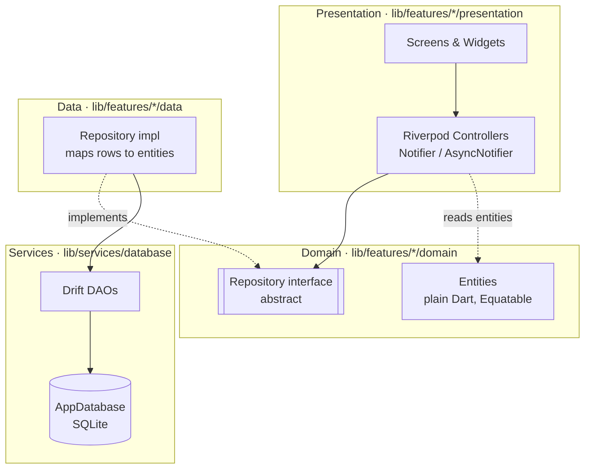
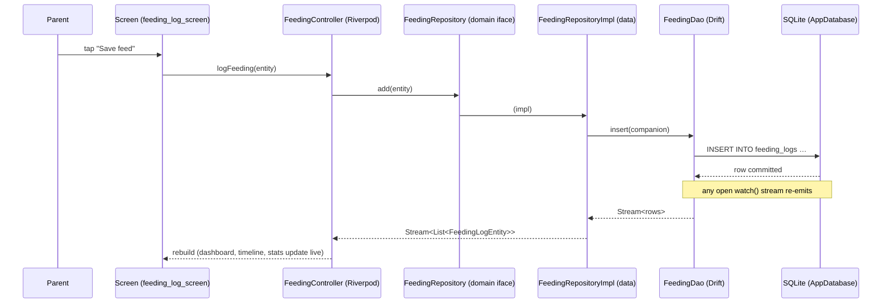
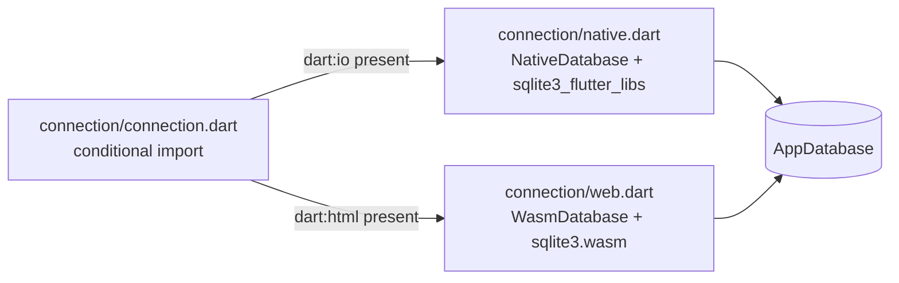
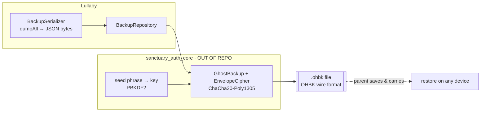

# Architecture Overview

> The one-page mental model of Lullaby, then the diagrams that make it concrete.
> For *why* each load-bearing decision was made, see [`docs/adr/`](../adr/). For
> exact schema and formats, see [`docs/reference/`](../reference/).

## What this is, in one paragraph

Lullaby is a **local-first Flutter app** built with **Clean Architecture**. Each
feature (feeding, sleep, growth, …) is a self-contained module split into three
layers — **presentation** (Flutter screens/widgets + Riverpod controllers),
**domain** (plain-Dart entities + an abstract repository interface), and **data**
(a repository implementation backed by a Drift DAO). All persistence is an
on-device **SQLite** database via **Drift**. State flows through **Riverpod**
providers. Nothing talks to a network in normal operation; the only ways data
leaves the device are an explicit **export** (CSV/PDF) or an **encrypted backup
file**.

## The layers (the single most important picture)

Dependencies point **inward**: presentation and data both depend on domain;
domain depends on nothing app-specific. This is what makes the trackers testable
against an in-memory database.

Two facts to hold onto:

1. **The controller only knows the `domain` interface.** It never imports Drift.
   Swapping the storage engine would touch `data/` and `services/`, not a single
   screen or controller. See [ADR-0002](../adr/0002-clean-architecture.md).
2. **Reads are reactive.** Repositories expose Drift `Stream`s (`watch…`) so a
   new feed logged on the dashboard updates the timeline and stats live, with no
   manual refresh.

## Data flow — logging one feed

The path a single write takes, and how the UI updates without a refresh:

- One-shot reads/writes return a **`Result<T>`** (`Success` / `Err(Failure)`,
  from `lib/core/errors/`) so a DB error becomes a typed value, not an exception
  that escapes to the UI. Live reads return **`Stream`s**.
- Providers wire it together: `databaseProvider` builds the single `AppDatabase`;
  each `…RepositoryProvider` hands its DAO to a repository impl; controllers
  `watch` the repositories. See `lib/core/providers/`.

## One database, native and web

The same Drift schema runs on native platforms and in the browser via a
compile-time connection switch — no runtime `if (kIsWeb)` scattered through the
app.

See [ADR-0006](../adr/0006-native-and-web-drift-connection.md). Foreign keys are
enabled per-connection (`PRAGMA foreign_keys = ON` in `database.dart`'s
`beforeOpen`), and hot per-baby/time-ordered queries are backed by explicit
indices created on migration.

## Encrypted backup (the only "sync-shaped" path)

Backup is **serialize → encrypt → write a file**; restore is the reverse, and it
is **destructive** (wipe-then-insert in one transaction). There is no server.

The crypto module (`sanctuary_auth_core`, plus its Flutter UI layer
`sanctuary_backup_ui`) is consumed as a path dependency on sibling
repositories (`../packages/sanctuary_auth_core`,
`../packages/sanctuary_backup_ui`), cloned by CI. The in-repo CI stub
previously at `ci/auth_stub/` has been removed — every build now runs the
real, audited crypto. See [ADR-0004](../adr/0004-encrypted-backup-seed-phrase.md),
[docs/reference/backup-format.md](../reference/backup-format.md), and
[docs/privacy-model.md](../privacy-model.md).

## Module map — where to look

| Concern | Location |
|---|---|
| **App shell / routing / theme** | `lib/app/` (`app.dart`, `router.dart`, `shell_screen.dart`, `theme/`) |
| **Cross-cutting** | `lib/core/` (`errors/` = `Result`/`Failure`, `extensions/`, `constants/`, `providers/`) |
| **Trackers** | `lib/features/tracking/` (feeding, sleep, diaper) |
| **Growth & WHO curves** | `lib/features/growth/` (`who_percentile_data.dart`) |
| **Health** | `lib/features/health/medicine/`, `lib/features/health/vaccine/` |
| **Aggregation & stats** | `lib/features/stats/` (`stats_aggregator.dart`, chart widgets) |
| **Dashboard / calendar / timeline** | `lib/features/dashboard/`, `lib/features/calendar/`, `lib/features/timeline/` |
| **Doctor summary** | `lib/features/doctor/` |
| **Export (CSV/PDF)** | `lib/features/export/` (`export_service.dart`, `_csvCell` safety fn) |
| **Encrypted backup** | `lib/features/sanctuary_backup/`, real crypto sibling `../packages/sanctuary_auth_core/`, UI sibling `../packages/sanctuary_backup_ui/` |
| **Baby profiles / switching** | `lib/features/babies/`, `lib/features/settings/` |
| **Home-screen widget** | `lib/features/home_widget/`, `lib/services/home_widget_service.dart` |
| **Database (schema/DAOs/migrations)** | `lib/services/database/` (`tables.dart`, `database.dart`, `daos/`, `connection/`) |

## Invariants that must always hold

Breaking one is a design regression, not a feature. (See [VISION.md](../VISION.md)
and [`docs/adr/`](../adr/).)

1. **No network in normal operation.** No account, telemetry, or ad SDK. Data
   leaves only by explicit export or encrypted backup.
2. **Domain depends inward.** Controllers and screens never import Drift; they
   talk to the abstract repository interface.
3. **Exported CSV is formula-injection-safe.** Every exported cell goes through
   `_csvCell`.
4. **Restore is atomic and destructive.** Wipe-then-insert in one transaction; a
   newer-schema backup is rejected, not partially applied.
5. **Foreign keys are enforced.** Parents before children; orphan cleanup on the
   v4 migration.
